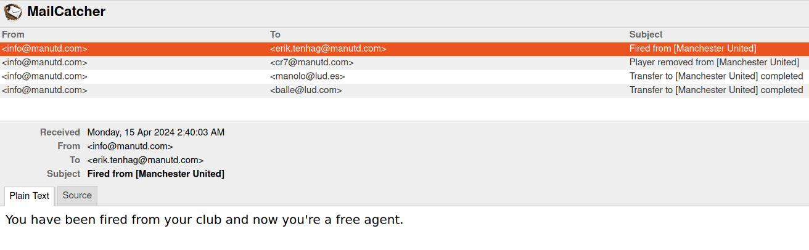
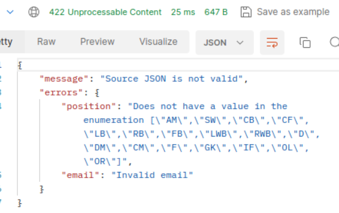
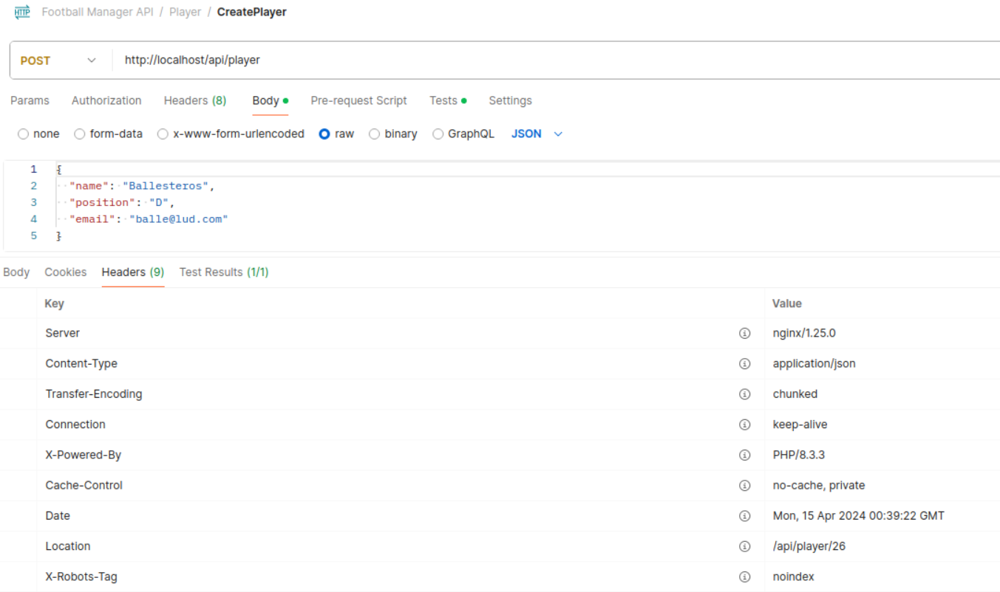
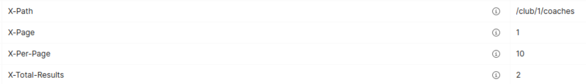

# Football Manager API

## Table of Contents

- [Description](#description)
  - [Strategy](#strategy)
    - [Structure design](#design-and-principles)
  - [Features](#features)
  - [Improvements](#possible-improvements)
- [Infrastructure](#infrastructure-used)
  - [Symfony Packages](#installed-symfony-packages)
- [Getting Started](#getting-started)
  - [Run using composer](#run-using-composer)
  - [Run using docker](#run-using-docker)
    - [Next steps](#important)
- [How it works?](#how-it-works)
  - [API](#api)
  - [PHPUnit Testing](#phpunit-testing)
  - [xDebug](#xdebug-debugger)
  - [Docker client host](#__client_host__-)
- [Troubleshooting](#troubleshooting)

## Description
Symfony mini-application with REST API that manages football clubs, players, and coaches.
Resources provided:
* [Database dump](https://github.com/mangelperis/Football-Manager-API/blob/main/databaseFM.sql)
* [Postman Collection](https://github.com/mangelperis/Football-Manager-API/blob/main/Football_Manager_API.postman_collection.json), Check [API](#api) section for more details.
* [Sample SQL Table Inserts](https://github.com/mangelperis/Football-Manager-API/blob/main/sampleSQLInserts.sql)

***

### Strategy
API implementation with Controllers that call Services.
Repository Pattern, along with DTOs, dependency injection, validation, logging, and other best practices helps create a modular, maintainable, and testable architecture for the Symfony API.
The business logic is kept separate from the data access and infrastructure concerns.

#### Design and Principles
The project structure follows the **hexagonal architecture** of Application, Domain, and Infrastructure.

Design patterns used:
- Dependency Injection (*any Service*)
- Entities (*Coach, Player, Club*)
- Repository (*ClubRepositoryDoctrineAdapter, CoachRepositoryDoctrineAdapter, PlayerRepositoryDoctrineAdapter*)
- Factory (*ResponseHandler*)
- Data Transfer Objects (*DTO*)
- Exception Handling (*InvalidArgumentException and LogicException*)
- Interfaces contract that allows easy implementation substitution (*NotifierInterface*)

Design principles used:
- Single Responsibility principle (SRP)
- Dependency Inversion (DI)
- DRY
- Serialize plus Normalize

### Features
The following key features are implemented
#### MailCatcher
* [MailCatcher](http://localhost:1080) is a tool used for intercepting and capturing emails during the development and testing of applications.


#### Project
* The project is prepared to manage that a Club can have (1:N) multiple Employees (Coach & Player), because of the ArrayCollection implementation.
* The club budget - employee salary implementation ensures realistic finance control while signing or laying off people.
  * Implemented notify system by mail. Clubs send emails to their players and coaches when signing or laying off them.
* Input body validation with *[Json-Schema](https://json-schema.org/)* ensuring mandatory required fields and type & length. 
  * Fields like [Player](https://github.com/mangelperis/Football-Manager-API/blob/main/app/src/Infrastructure/Validation/Schemas/player.json)->position or [Coach](https://github.com/mangelperis/Football-Manager-API/blob/main/app/src/Infrastructure/Validation/Schemas/coach.json)->role are always the expected ones from a list.
* Property validation (mostly the type) for the Entities before persisting them, including:
  * Assert `email` validation.
  * Club `country` value to mandatory follow the  [country alpha-2 ISO.](https://en.wikipedia.org/wiki/ISO_3166-1_alpha-2)
  * Timestamps. Automated creation of `created` and `updated` table columns.
* Ensure any input data is validated, either using JSON-schema or Asserts.

#### Good practices
* Manual logging and Exceptions catching during the service and controller process.
  * Log critical exceptions, like code errors, and return generic response messages like 'Something went wrong' to the API client to not provide details. 
  * Return bad logic or invalid format input to the client with the reason and details, so they can correct it.
  
* Return to the API client proper JSON responses, and HTTP codes along custom headers like:
  * Location when creating a new register, being able to track its `id` for follow-up queries.
  
  * Metadata like page, limit, or total results
  
* Defined individual DTO objects for the Entities, so they could be merged with any desired resourced response. An example of this is the `get_club_details` service, which merges the Club, Coaches, and Players DTO.

#### Logic
* Persist data only if it doesn't exist, update fields if it does (*Create* endpoints).
* Transform stored data to DTO, and then normalize it with a serializer.
* Normalize the stored data to JSON response with a serializer.
* Adapters and Ports. Change of stack easily by only adapting the Infrastructure layer.
  * Service gets the injection of the Interface instead of the Service class, so he doesn't know the type of source/end.
  * Notifier for Email sender, or the ResponseHandler for JSON responses
    * Exception are the *DoctrineRepositories* for MySQL databases, they were injected directly so the extended EntityService queries like `find` could be used.
      *  These repositories implement the interfaces for their expected operations: save, update, delete, etc...

#### Performance
* It takes an average of 20 to 30ms to process any request. 

### Possible improvements
* Some required composer packages have version conflicts with the newest Symfony releases. I had to downgrade from SF 7 to 6.4 because of it. Maybe substitute these packages for others.
* Some logic from the services, could be transferred to the infrastructure layer in an adapter, it wasn't done to not add extra complexity.
* An output **DTO** should be used to return data results in the **CustomBookingNormalizer**, to standardize the desired output against any client.
* Some **constants** defined should be retrieved from the cache system, database, or the `.env`, so they would be easier to set on demand.
* The pagination provided for some endpoints is basic, implement a proper metadata return to the user also.

***

## Infrastructure used
* Symfony 7
* Docker
  * PHP 8.3 (w/ opcache & [xDebug](#xdebug-debugger))
  * Nginx
  * MariaDB 11.1.4
  * Adminer 
  * MailCatcher 

### Installed Symfony Packages
* **phpunit/phpunit**: testing framework for PHP
* **doctrine/orm**: simplifies database interactions by mapping database tables to PHP objects.
* **doctrine/doctrine-fixtures-bundle**: predefined sets of data used for testing or populating a database with initial data.
* **symfony/http-client**: HTTP client for making HTTP requests and interacting with web services.
* **symfony/validator**: tools for validating data according to predefined rules.
* **symfony/maker-bundle**: facilitates rapid development by automating the creation of boilerplate code.
* **phpstan/phpstan**: an analysis tool for PHP code, to detect and fix issues,
* **friendsofsymfony/rest-bundle**: simplifies the implementation of RESTful APIs.
* **symfony/serializer**: serialization system for converting between objects and arrays, to JSON, XML, YAML, and CSV.
* **stof/doctrine-extensions-bundle**: doctrine extensions, features to ORM entities (Timestampable)
* **symfony/mailer**: symfony mailer to send mails
* **justinrainbow/json-schema**: allows you to define the structure and constraints of the JSON data that your API expects.

***

## Getting Started
Copy or rename the `.env.dist` files (for docker and symfony) to an environment variable file and edit the entries to your needs:
```
cp ./app/.env.dist .env && cp ./docker/.env.dist .env
```

### Run using composer

`composer run` commands are provided as **shortcuts**.

Use `composer run setup` to start and initialize all needed containers.

Available commands are:
```
composer run [
    setup             --- Build the docker images and run the containers in the background.
    build             --- Build the docker images.
    up                --- Run the containers in the background.
    down              --- Stop the containers.
    logs              --- Show container sys logs (php-fpm, nginx, and MariaDB).
    cache-clear       --- Execute Symfony clear cache command.
    stan              --- Execute PHPStan analyse command.
    test              --- Execute PHPUnit test cases.    
]
```

A folder named `var` will be created in the project root folder upon the first run. This folder includes the database files and server logs to provide help while developing.

### Run using docker
Alternatively to the use of `composer`, you can directly build & run the app by using the following docker commands:

* Use `docker compose` to start your environment.
  * Add the _param_ `-d` if you wish to run the process in the background.
  * Add the _param_ `--build` the **first time** to build the images.
  * Add the _keyword_ `down` to stop the containers.
```
# Build & up. From the project's root folder exec
docker-compose up -d --build
```

#### IMPORTANT
After booting the container, run `composer install` from outside or inside the container.
```
docker exec -t php-fpm composer install
```
Then run the database migrations to create the mysql structure for both **dev** and **test** environments.
```
docker exec -t php-fpm php bin/console doctrine:migrations:migrate --env=dev --no-interaction
```

```
docker exec -t php-fpm php bin/console doctrine:database:create --env=test --no-interaction
docker exec -t php-fpm php bin/console doctrine:migrations:migrate --env=test --no-interaction
```

After booting the container, you can use this command to enter inside it and execute commands (the container's name is defined in the _**docker-compose.yml**_ file):
```
docker exec -it $container_name bash
```
or identify the name of it displayed under the column `NAMES` of this command output:
```
docker ps
```
There's an alias being created upon the build process, and it will allow you to execute the Symfony command directly only with `sf`. Example:
```
sf debug:router
```
***

## How it works?
You have up to 5 containers running depending on whether you choose to use nginx or apache: php-fpm + nginx or php-apache, mariadb, redis, and optionally, adminer.
Check the running containers by using the command: ``docker ps``
- [Symfony Web-App welcome page](http://localhost:80)
- [Adminer [optional] (simple database manager)](http://localhost:8080)
- [MailCatcher [optional] (catches and displays sent mail)](http://localhost:1080)

#### API
Use Postman or another CLI to perform actions on each endpoint.
A [postman collection](https://github.com/mangelperis/Football-Manager-API/blob/main/Football_Manager_API.postman_collection.json) is provided with the project with the source data endpoint and the destination one.

The list of available endpoints can be shown by executing (target **php-fpm** or **php-apache** container):
```
docker exec php-fpm php bin/console debug:router
```
Provided endpoints are:
```
  Name                      Method    Path                         
 ------------------------- --------  ----------------------------- 
   
  create_club               POST     /api/club                    
  update_club_budget        PUT      /api/club/{clubId}/budget    
  get_club_details          GET      /api/club/{clubId}/details   
  create_coach              POST     /api/coach                   
  delete_coach              DELETE   /api/coach/{id}              
  attach_coach_to_club      POST     /api/club/{clubId}/coach     
  remove_coach_from_club    DELETE   /api/coach/{coachId}/club    
  list_club_coaches         GET      /api/club/{clubId}/coaches   
  create_player             POST     /api/player                  
  delete_player             DELETE   /api/player/{id}             
  attach_player_to_club     POST     /api/club/{clubId}/player    
  remove_player_from_club   DELETE   /api/player/{playerId}/club  
  list_club_players         GET      /api/club/{clubId}/players   

```

#### PHPUnit Testing
Additionally, run all the tests available using (target **php-fpm** or **php-apache** container):
```
docker exec php-fpm ./vendor/bin/phpunit --verbose
```
or
```
composer test
```

***

#### xDebug debugger
xDebug (the last version) is installed and ready to use. Check the config params in `/docker/extras/xdebug.ini`
By default, these are the main critical parameters provided:
+ [mode](https://xdebug.org/docs/all_settings#mode) = develop,debug
+ [client_host*](https://xdebug.org/docs/all_settings#client_host) = host.docker.internal
+ [client_port](https://xdebug.org/docs/all_settings#client_port) = 9003
+ [idekey](https://xdebug.org/docs/all_settings#idekey) = PHPSTORM
+ [log_level](https://xdebug.org/docs/all_settings#log_level) = 0

Please check the [official documentation](https://xdebug.org/docs/all_settings) for more info about them.
Add the call to `xdebug_info()` from any PHP file to show the info panel.

####  __client_host__ (*)
Depending on your environment, it's **required** to add the following to the **_docker-composer.yml_** file to enable 
communication between the container and the host machine. By default, this is **ON**.
```
extra_hosts:
    - host.docker.internal:host-gateway
```
If you find it's not working after setting up your IDE, try to comment on section and change the [xDebug.ini file](/docker/extras/xdebug.ini)
accordingly.

***

## Troubleshooting
Nothing else for now!


